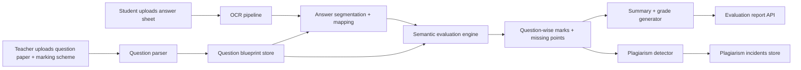

# Architecture

## Delivery scope

This repository implements the orchestration layer for a real-world automated answer-sheet evaluation system:

- OCR ingestion for typed and handwritten documents through pluggable providers
- question parsing and answer-to-question mapping even when answers are out of order
- rubric-aware scoring and feedback generation
- plagiarism comparison against prior submissions
- API-first backend with persistence and report retrieval

It is production-oriented, but `>95%` real-world accuracy depends on domain data, model tuning, and human review calibration. The architecture below is designed to support that path cleanly.

## End-to-end pipeline

## Recommended model stack

### OCR

- Primary for scanned handwriting: `TrOCR`, `Donut`, or a hosted vision-language model
- Secondary for text-layer PDFs: `PyMuPDF` extraction
- Backup for images: `Tesseract` or `EasyOCR`
- Layout enhancement: `LayoutLMv3` or `DiT` for difficult multi-column papers

### Answer evaluation

- Rubric-grounded reasoning model:
  - hosted LLM for teacher-facing justification
  - fine-tuned encoder or reranker for concept coverage
- Retrieval and similarity:
  - `SentenceTransformers` embeddings for rubric point recall
  - cross-encoder reranking for final mark calibration
- Structured grading head:
  - features from coverage, semantic alignment, factuality, and depth
  - regression or ordinal classification model for mark prediction

### Plagiarism detection

- Text embeddings per answer
- structural similarity from question order and answer layout
- image fingerprinting for scanned duplicates
- ANN search for large classrooms

## Data flow

1. Upload assets and store raw files.
2. Extract text from question paper, marking scheme, and answer sheet.
3. Parse question paper into `QuestionBlueprint` records:
   - question number
   - section
   - prompt
   - marks
   - expected key points
4. Split answer sheet into detected answer blocks.
5. Map blocks to questions using:
   - explicit question numbers first
   - semantic fallback second
   - sequential fallback last
6. Evaluate each mapped answer using rubric coverage, semantic alignment, and depth.
7. Generate:
   - question-wise marks
   - missing key points
   - ideal answer outline
   - overall grade and summary
8. Compare the new submission against historical submissions from the same paper.
9. Persist the evaluation and plagiarism report for teacher dashboards and audits.

## Preprocessing strategy

- PDF text extraction for digital documents
- OCR on page images for scanned sheets
- whitespace cleanup and sentence segmentation
- question-number normalization such as `Q1`, `1)`, and `1.`
- answer block segmentation using line-start markers
- fallback semantic matching when numbering is unreliable

## Training strategy

### Dataset requirements

- scanned handwritten answer sheets across many handwriting styles
- typed answer sheets and mixed-mode documents
- question papers with structured labels and mark allocations
- marking schemes with teacher rubric points
- historical graded scripts with awarded marks and teacher comments
- plagiarism-labeled submission pairs

### Labeling plan

- annotate question boundaries on answer sheets
- label answer-to-question mappings
- record per-question marks and teacher rationale
- extract rubric coverage labels for each key point
- label plagiarism pairs and copied spans

### Handwriting diversity handling

- collect writing samples across age groups, pens, languages, scan quality, and paper types
- augment with blur, skew, shadows, folds, contrast shifts, and compression artifacts
- include difficult cursive and mixed print/cursive sets
- build low-confidence routing to human review

### Fine-tuning roadmap

1. OCR fine-tuning on answer-sheet crops with teacher handwriting.
2. answer mapping model with contrastive training:
   - positive pair: answer block and correct question
   - hard negatives: nearby or similarly themed questions
3. rubric coverage model:
   - multi-label prediction for expected key points
4. mark prediction model:
   - regression or ordinal classification using rubric coverage and semantic features
5. plagiarism dual-encoder:
   - train on copied versus non-copied answer pairs

## Scalability design

- stateless FastAPI API layer
- background workers for OCR and scoring
- object storage for files
- PostgreSQL for metadata
- vector store for answer embeddings
- Redis queue for throughput spikes
- teacher review queue for low-confidence outputs

## Confidence and moderation

Every question result should expose:

- mapping confidence
- evaluation confidence
- plagiarism confidence

Low-confidence responses should be routed to manual review instead of auto-publishing marks.
